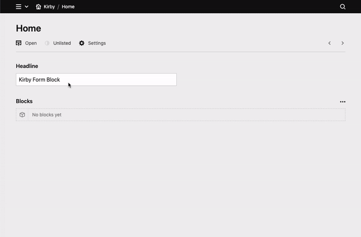

# Kirby Form Block

## Overview

This form plugin for Kirby offers you maximum flexibility and usability.
It can be used as a block anywhere you needed. Even multiple times per page.

Based on the great features of [Kirby 3.6](https://getkirby.com/releases/3.6).





**Packed with a rich set of features:** 🎉


✅ &nbsp; Editors can flexibly organise the form fields.

✅ &nbsp; A custom form field can be easely added with just 2 files (Blueprint & Template).

✅ &nbsp; Each form field has a set of fields applied (which you can easily modify).

✅ &nbsp; A newly created form block will be automatically filled by data from a JSON file (which you can copy from the form block).

✅ &nbsp; Incoming requests can be viewed and managed within the block. (optional)

✅ &nbsp; You and/or the visitors will receive an email on incoming requests. (If desired)

✅ &nbsp; incomming from data can be used as Placeholders in all available text blocks (email messages, subject, error/confirmation messages, etc.).

✅ &nbsp; Custom placeholders can be added in the config file. (E.g. for using of the IP address, etc.).

✅ &nbsp; Language support for English and German.


## Before we start

To keep the base clear, only the most basic elements are used by default. 
In the plugin folder under 'lib' you will find a few extensions that you can use in your project.

Help to complete this folder with your examples.
Make a [pull request](https://github.com/youngcut/kirby-form-block/pulls) or [email](mailto:kirby@microman.ch) a zip with your code

> A lot of hours were invested in this plugin with the goal that you can add contact forms to your Kirby projects in a time-saving and easy way.
> If you want to show your appreciation for this, [donate a contribution](https://www.paypal.com/donate?hosted_button_id=LBCLZVHS4K2R6) or buy kirby license(s) by using [this affiliate link](https://a.paddle.com/v2/click/1129/136529?link=1170)


## Installation

For use with Kirby 3.6+ only! ([update here!](https://github.com/getkirby/kirby))
Download and copy this repository to your plugin folder: `/site/plugins/`

**Composer**

`composer require microman/kirby-form-blocks`

## Basic usage

Just put `form` in your fieldsets of your blocks field:

```yml
fields:
  text:
    type: blocks
    fieldsets:
      - form
      ...
```

If you're not familar with Kirbys blocks field [check this out](https://getkirby.com/docs/reference/panel/fields/blocks).

On the *blocks preview*, you can set the name of your form and also check, if there's new requests.
Inside the blocks settings you have 3 tabs:
- *Inbox:* Shows you all requests. Set them to (un)read, delete it or change the view of the individual entries with placeholders. (Change display text)
- *Form fields* Manage the form fields that will displayed to the visitors. You can add more types of form fields. (more later)
- *Options* Sets the behavior on receipt of the request. Can be extended this with other fields

## Customize the output

Copy ´site/plugins/kirby-form-blocks/snippets/blocks/´ to ´site/snippets/blocks/´ and edit the files.

> Check `/site/plugins/kirby-form-blocks/lib/templates`. Maybe there's a template for your framework.

## Define default values

Your editor won't add the basics formfield each time when a form block is created.
To define the default form fields and form options follow these steps:

1. Create a form block
2. Fill it as desiered
3. Copy the form block
4. Paste it into ´site/config/formblock_default.json´

> If your site is multilanguage, you can set a postfix behind the filename for each language on your site. (e.g `formblock_default_de.json`) 

> Have a look to `/site/plugins/kirby-form-blocks/lib/configs/*.json`. Maybe you'il find there some useful defaults.

## Add a new form field type

> First check `/site/plugins/kirby-form-blocks/lib/formfields` if there is already a desired form field.

Let's say we want to create an form field that shows some information:

_site/blueprints/blocks/formfields/info.yml_
```yml
name: Information
icon: alert

fields:
  title:
    type: text
    width: 1/2
  color:
    type: select
    width: 1/2
    options:
      green: Green
      orange: Orange
      red: Red
  info:
    label: form.block.fromfields.select.placeholder
    type: writer
```

_site/snippets/formfields/info.php_
```xml
<div class="info-field" id="<?= $formfield->slug() ?>" style="background:<?= $formfield->color() ?>">
    
    <?php if($formfield->title()->isNotEmpty()): ?>  
        <h3><?= $formfield->title() ?></h3>
    <?php endif ?>

    <?= $formfield->info() ?>

</div>
```

Isn't that simple? 🤷‍♂️

> To sort the fields in panel, you can use prefix like `05_fieldname` on blueprints filename. Default fields stays on top.

> To disable a default form field copy `site/plugins/kirby-form-field/blueprints/blocks/formfields` to `site/blueprints/blocks/formfields` and remove the content of the desiered file.

## Customize the blueprint

### Custom fields in form fields

There are custom fields for each form field. To modify it, copy `site/plugins/kirby-form-field/blueprints/blocks/customfields.yml` to `site/blueprints/blocks` and edit it.

Use it in the output: `$form->fields()->your_field()`.

### Form options

In the option tab you can add more fields: Copy `site/plugins/kirby-form-field/blueprints/snippets/form_options.yml` to `site/blueprints/snippets` and edit the blueprint.

Use fields in the output: `$form->your_field()`

> There are also `form_confirm.yml`and `form_notify.yml` in that snippets folder. DO NOT modify them! Better disable the underlying function in the config.

## Config

### Email adress for outgoing emails

```php
'microman.formblock' => [
    'from_email' => 'info@example.com'
],
```
Default: `no-reply@[the root url of your website]`

> If the domain is differ form the websites domain [check the DMARC](https://de.wikipedia.org/wiki/DMARC) to ensure that the emails will not rejected.

> You probably get an SMTP-Error on localhost environment. Test the email function on a server!

### Placeholders

In addition to the incoming form data, extra placeholders can be defined. (Which can be used with `{{}}`)For example, to determine the IP address of the sender:

```php
'microman.formblock' => [
  'placeholders' => [
    'ip' => [
      'label' => "IP address",
      'value' => function ($fields) {
        return $_SERVER['REMOTE_ADDR'];
      }
    ]
  ]
],
```

> Examples are stored in `/site/plugins/kirby-form-blocks/lib/configs/placeholders.php`.


> ☝️ You can manipulate the way inbox shows the form data. This is the default placeholder named `summary`.

### Disable Functions

Functions like _request saving_, _notification email_ or _confirmation email_ can be disabled:

```php
'microman.formblock' => [
  'disable_inbox' => true,
  'disable_confirm' => true,
  'disable_notify' => true,
],
```

The corresponding function will be no longer executed and in the panel the tab/fields won't be visible anymore.

### Disable Placeholder Hint

To hide the placeholder info field set `'disable_placeholder_hint' => true`

## Conclusion

If you have any questions or something is not working properly, [please let me know](https://github.com/youngcut/kirby-form-block/issues).

The following functions are planned in the future:

- Hooks in several places
- Displaying the requests in areas. So all come together in one place.
- API for incomming requests (without reloading the page)
- Templates for bootstrap
- Repair the default selector for options and select. (Help me 🥺)

You are welcome to make your [contribution](https://github.com/youngcut/kirby-form-block/pulls).

Hope you will enjoy this plugin. Stay tuned!
