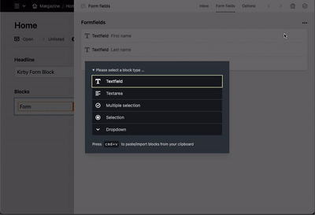
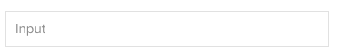
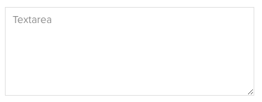
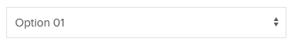

# Kirby Form Block

## Overview

This form plugin for Kirby offers you maximum flexibility and usability.
It can be used as a block anywhere you needed. Even multiple times per page.

Based on the great features of [Kirby 3.6](https://getkirby.com/releases/3.6).





**Packed with a rich set of features:** 🎉


✅ &nbsp; Editors can flexibly organise the form fields.

✅ &nbsp; Spam protection with an integrated honeypot. (Since V2.0)

✅ &nbsp; Create a custom form field easely by added with just 2 files (Blueprint & Template).

✅ &nbsp; A newly created form block will be automatically filled by default data from a JSON file (which you can copy from a existing form block).

✅ &nbsp; Incoming requests can be viewed and managed within the block. (optional)

✅ &nbsp; You and/or the visitors will receive an email on incoming requests. (If desired)

✅ &nbsp; Custom form data can be defined in the config file. (E.g. for using of the IP address, etc.).

✅ &nbsp; Language support for English and German. Messages are fully customizable/expandable for developers and/or editors.


## Before we start

>Do you miss a feature? [Check this out!](https://kirby-form-blocks.nolt.io/)
>
>Upvote and donate. Maybe your feature will be implemented soon! 

## Installation

For use with Kirby 3.6+ only! ([update here!](https://github.com/getkirby/kirby))
Download and copy this repository to your plugin folder: `/site/plugins/`

**Composer**

`composer require microman/kirby-form-blocks`

## Basic usage

Just put `form` in your fieldsets of your blocks field:

```yml
fields:
  my_block:
    type: blocks
    fieldsets:
      - form
      ...
```

If you're not familar with Kirbys blocks field [check this out](https://getkirby.com/docs/reference/panel/fields/blocks).

On the *blocks preview*, you can set the name of your form and also check, if there's new requests.
Inside the blocks settings you have 3 tabs:
- *Inbox:* Shows you all requests. Set them to (un)read, delete it or change the view of the individual entries with placeholders. (Change display text)
- *Form fields* Manage the form fields that will displayed to the visitors. You can add more types of form fields. (more later)
- *Options* Sets the behavior on receipt of the request. Can be extended this with other fields

### Define default form block data

If your editor use more or less the same form multiple time, it can be usefull to set the default setting.
To define the default form fields and form options follow these steps:

1. Create a form block
2. Fill it as desiered
3. Copy the form block
4. Paste it into ´site/config/formblock_default.json´

> If your site is multilanguage, you can set a postfix behind the filename for each language on your site. (e.g `formblock_default_de.json`) 


### Customize the Output
Quick and easy: Copy `site/plugins/kirby-form-blocks/snippets/blocks/` to `site/snippets/blocks/` and edit the files.


### form field types

Following form field types are available by default:

|  | Name   |  Output |
|:-:|:-|:-------------|
|1|input| |
|2|textarea| |
|3|select| |
|4|checkbox| |
|5|radio| |

**Add a custom form field types**

Let's say you want to create an form field that shows some information to your visitors:

_site/blueprints/blocks/formfields/info.yml_
```yml
name: Information
icon: alert

fields:
  title:
    type: text
    width: 1/2
  color:
    type: select
    width: 1/2
    options:
      green: Green
      orange: Orange
      red: Red
  info:
    label: form.block.fromfields.select.placeholder
    type: writer
```

_site/snippets/formfields/info.php_
```xml
<div class="info-field" id="<?= $formfield->slug() ?>" style="background:<?= $formfield->color() ?>">
    
    <?php if($formfield->title()->isNotEmpty()): ?>  
        <h3><?= $formfield->title() ?></h3>
    <?php endif ?>

    <?= $formfield->info() ?>

</div>
```

Et voilà. You just created a new form field type:


> To sort the fields in panel, you can use prefix like `05_fieldname` on blueprints filename. Default fields stays on top.

**Modify default form field types**

Just copy `site/plugins/kirby-form-field/blueprints/blocks/formfields` to `site/blueprints/blocks/formfields` and edit it.

> To disable a default form field type, just remove the content of the file.

### Custom fields

Each form field has by default following fields:

|  Name |   Description |
|:-------|:-------------|
| Display name | Used for labels |
| Unique identifier | It's required to work with fields.|
| Context | Defines the kind of input. Is needet for autocompletition and the spam protection.
| Required | The visitor must fill this field

> Make shure that the unique identifier is only just once used in the whole form block!

**Add custom fields to all form field types**

Let's make an example and adding a field for the width:

_site/blueprints/blocks/customfields.yml_
```yml
width:
  label: Width
  type: select
  options:
    col-12: "1/1"
    col-6: "1/2"
    col-4: "1/3"

```

_Output:_
```xml
<?php foreach ($form->fields() as $field) : ?>

  <div class="<?= $field->width() ?>">

    <?= $field->toHtml() ?>

  </div>
<?php endforeach ?> 
```

## Messages

Messages are text fragments, that can be used in your code like this: `$form->my_message()`.

Following messages are available by default:

| Key   |   Description |
|:-|:-------------|
|notify_subject| Subject of notification email |
|notify_body | Content of notification email
|confirm_subject | Subject of confirm email
|confirm_body | Content of notification email
|success_message | Message that shows to visitor if form is successfully send
|fatal_message | Message that shows to visitor if something went wrong, |field_message | Message that shows to visitor if a field ist not filled properly
|invalid_message | Summary for all fields with error. {{ fields }} insert a list of invalid formfields
|exists_message | Form already filled (if verify_content enabled)
|send_button | No explanation needed 🤷‍♂️

**There are 3 ways to change/add messages (in order of priority):**

1. Translation-Files inside the plugin `site/plugins/kirby-form-field/lib/languages/*.php` -> `form.block.*`
2. [In the config with translations](translations-since-v2.0)
3. As custom field in the option tab. To modify fields in the option tab, copy `site/plugins/kirby-form-field/blueprints/snippets/form_options.yml` to `site/blueprints/snippets` and edit the blueprint:

```xml
success_message:
  label: Custom success message
  type: writer

my_custom_message:
  label: Custom Message
  type: writer

```
> As you see, you can also insert fields for the default messages to let the editor customize it.

> There are also `form_confirm.yml` and `form_notify.yml` in that snippets folder. DO NOT modify them! Better disable the underlying function [in the config](#disable-functions).

### Placeholders

Use placeholder for every messages like this: `Hello  {{given-name}}`. For more info read [in the config->placeholders](#placeholders-1).

## Object

### Form Object

The form object provides you with a few useful methods that help you to work with the form block: (e.g. `$form->showForm()`)

|  Method |   Description | Parameter |
|--|:-------------|--|
| showForm | Returns `true` if the form is ready to fill  | (None) |
| fields | Returns form fields. | *\$attrs:* Array or string of desired Attibutes (e.g. 'label' returns the title of the field, `null` returns a form field object) |
| field | Returns a form fields by unique identifier | *\$slug:* unique identifier of the field<br />*\$attrs:* Array or string of desired Attibutes (e.g. 'label' returns the title of the field, `null` returns a form field object) |
| isFilled | Returns `true` if the visitor send the form | (None) |
| isValid | Returns `true` if the visitor filled the form correctly | (None) |
| isFatal | Returns `true` if something went terribly wrong | (None) |
| isSuccess | Returns `true` if the request was successfully send | (None) |
| errorFields | Returns as list or array of invalid form fields  | *\$separator:* Char to Separate the field names. <br/>`null` returns an array |
| message | Returns a message | *\$key:* Key of the Text<br />*\$replaceArray:* Additional Placeholder |
| errorMessage | Returns error Message if `isFatal` | (None) |
| successMessage | Returns success Message if `isSuccess` | (None) |
| sendNotification * | Send Email to operator ([if notify enabled](#disable-functions))    | *\$body:* Content of the Email<br />*\$recipient:* Email to send to (optional) |
| sendConfirmation * | Send Email to visitor ([if confirm enabled](#disable-functions))    | *\$body:* Content of the Email<br />*\$reply:* Email that the visitor can answere (optional) |
| setError | Brings the form to state `isFatal` | *\$error:* Error message<br />*\$save:* If `true` the request will saved in the Inbox  |

> \* Use only if you like to send extra emails. By default, the emails are sent automatically by the plugin after successful completion.

### Form Field Object

|  Method |   Description | Parameter |
|--|:-------------|--|
| * | Returns the field from the formfield.<br/> (e.g `$field->custom_field()`) | (None) |
| value | Value from form data or default value | *\$raw*: `true`...<br/> ...returns the value without HTML escaping<br/>...with Options: returns the slug (not the Label)  |
| label | Display Name | (None) |
| slug | Unique identifier | (none) |
| autofill | Context for autocompletition | *\$html:* <br/>`null` returns bool<br/> `attr` returns ' autocomplete="my_context"' |
| required | return true or expression if field is required | *\$html:* <br/>`null` returns bool<br/>`asterisk` returns ' * '<br/>`attr` returns ' required' 
| type | Returns the field type | (none) |
| isFilled | Returns true if the form field is not empty | (none) |
| isValid | Returns true if the form field is filled correctly | (none) |
| errorMessages | Returns an array of all errors, if invalid. | (none) |
| errorMessage | Returns one errors, if invalid. | (none) |
| hasOption | Returns `true` if the form type is:<br/>checkbox, radio or select |(none) |
| selectedOptions | Returns array of selected options | *\$prop:* Desired property. Default = Value |
| options | Returns a structure field with the options | (none) |
| ariaAttr | Returns the aria-attribute. (For invalid fields) | (none) |

## Config

### Email adress for outgoing emails

```php
'microman.formblock' => [
    'from_email' => 'info@example.com'
],
```
Default: `no-reply@[the root url of your website]`

> If the domain is differ from the website domain [check the DMARC](https://de.wikipedia.org/wiki/DMARC) to ensure that the emails will not rejected.

> You probably get an SMTP-Error on localhost environments. Test the email function on a server!

### Placeholders

In addition to the incoming form data, extra placeholders can be defined. (Which can be used with `{{}}` in your messages)
For example, to determine the IP address of the sender:

```php
'microman.formblock' => [
  'placeholders' => [
    'ip' => [
      'label' => "IP address",
      'value' => function ($fields) {
        return $_SERVER['REMOTE_ADDR'];
      }
    ]
  ]
],
```

### Disable Functions

Functions like _request saving_, _notification email_ or _confirmation email_ can be disabled:

```php
'microman.formblock' => [
  'disable_inbox' => true,
  'disable_confirm' => true,
  'disable_notify' => true,
],
```

The corresponding function will be no longer executed and in the panel the tab/fields won't be visible anymore.

### Verify Content (Since V2.0)

To ensure that the visitor does not submit the form more than once (for example by refreshing the page), this Plugin checks whether a form with the same content has been submitted already. In this case, an error message is shown to the visitor.

This function is automatically enabled and can be disabled with this example:

```php
'microman.formblock' => [
  'verify_content' => false,
],
```

### Translations (Since V2.0)

[See chapter Messages](#messages) for mor information

```php
'microman.formblock' => [
  'translations' => [
    'en' => [
        'success_message' => 'Form send!'
    ],
    'de' => [
        'success_message' => 'Formular versendet!'
    ]
  ]
],
```

## Conclusion

If you have any questions or something is not working properly, [please let me know](https://github.com/youngcut/kirby-form-block/issues).


Hope you will enjoy this plugin. Stay tuned!
